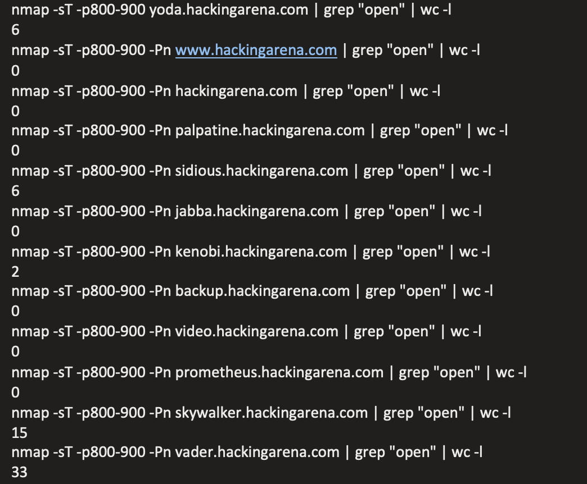
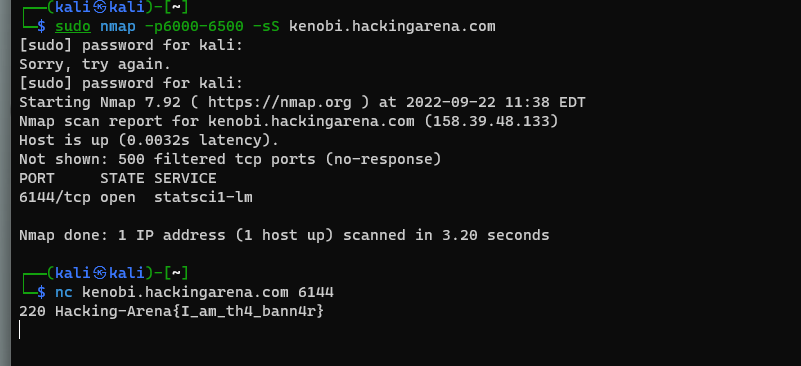

## Networking 

### Bluebox

--------------------------------------
 The answer is: bluebox-test-server.mit.edu (18.8.3.1)
  
<b>Description:</b>
 
  
        nmap -sL 18.8.0.0/16 | grep blue

### Hackingarena ports
 ----------------------------------------------

 The answer is: 62

 I used nmmapper.com to find all the subdomains since nmap is slow and unreliable.
 and then scanned the ports for each of them.

### Service flag
 ----------------------------------------------

