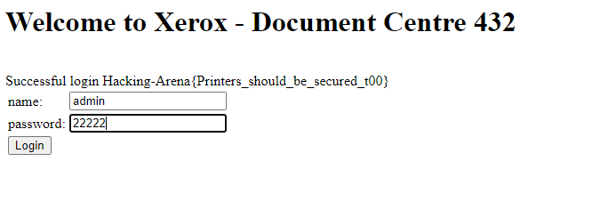
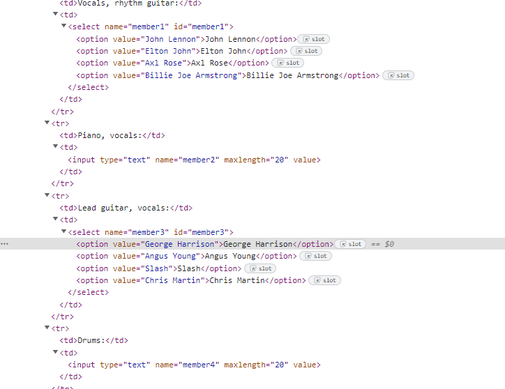
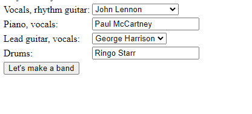
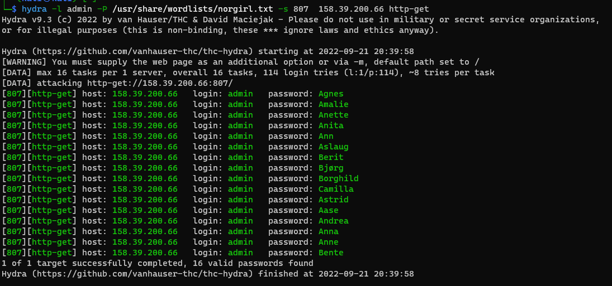
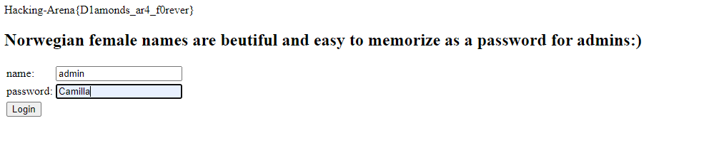

# Web Hacking

## Web 1

**Find the flag on the following site: http://vader.hackingarena.com:805/**

--------------------------------------------------------------------------------

I tried Visiting the http://vader.hackingarena.com:805/robots.txt 

that gave me subfolders, and */nothinguseful* subfolder which had the flag

## web 2 

**Find the flag here: http://kenobi.hackingarena.com:837**

--------------------------------------------------------------------------------

i searched for default credentials for Xerox 

## The beatles

**Hey, let's bring Beatles back together: http://vader.hackingarena.com:828**

----------------------------------------------------------------------------

Hacking-Arena{I've_got_my_flag_set_on_you}

I tried to change the html code of the page.
max length of inputs => 20
and changed the value of options 

## web 3 

**Find the flag here: http://vader.hackingarena.com:809/**

--------------------------------------------------------------------------------

## norwegian girl name 

**Find the flag here: http://vader.hackingarena.com:809/**

--------------------------------------------------------------------------------

I tried different methods and tools like brutex, burp-suit, nmap etc.

and then tried hydra to brutforce into the website but the passwords i got didnt work.

So i made a girl name list and run hydra again. That gave me couple of names which i tried Until i got Camilla as password

